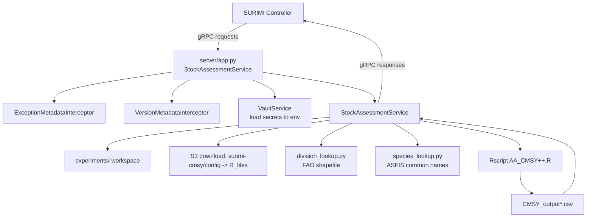
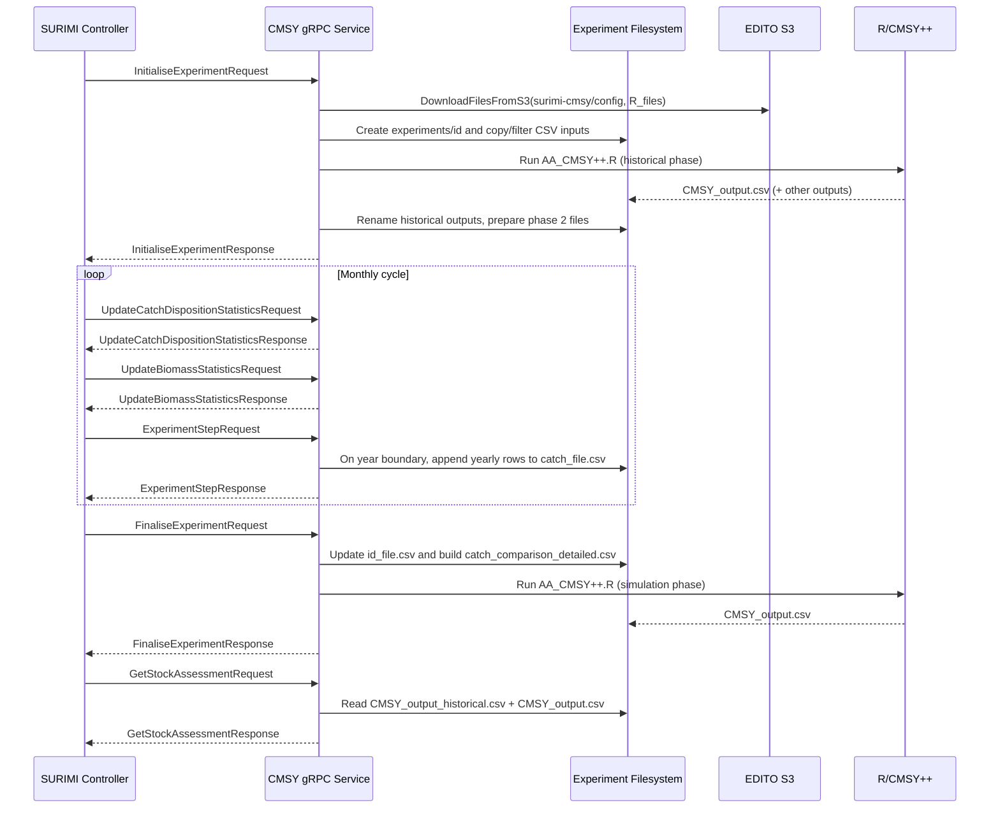

# SURIMI-CMSY — Architecture

## Overview
SURIMI-CMSY is the CMSY++ stock-assessment model service within the SURIMI platform.  
It exposes a Python gRPC service (`StockAssessmentService`) and exchanges model lifecycle and statistics messages with the SURIMI controller over gRPC.  
The service orchestrates experiment state, monthly simulation aggregation, CSV preparation, and execution of the CMSY++ R workflow.

## Responsibilities
- Host the gRPC `StockAssessmentService` on port `5021`.
- Initialize and manage experiment workspaces under `experiments/<experiment_id>`.
- Validate model constraints (notably monthly-only timestep `P1M`).
- Ingest and aggregate monthly biomass and catch-disposition statistics.
- Maintain CMSY input/output CSV contracts (`catch_file.csv`, `id_file.csv`, related historical/derived files).
- Run the CMSY++ R script (`AA_CMSY++.R`) and expose model output via `GetStockAssessment`.
- Enrich stock-level output using FAO division and ASFIS common-name lookup assets.
- Load runtime secrets from Vault into environment variables before service operation.

## Interfaces
### Lifecycle messages
#### Client gRPC messages (controller -> CMSY)
- `InitialiseExperimentRequest`: starts a new experiment and provides simulation setup and contract species.
- `ExperimentStepRequest`: advances the simulation by one step (must remain monthly cadence).
- `FinaliseExperimentRequest`: finalizes experiment data and triggers final CMSY++ assessment.
- `CancelExperimentRequest`: requests cancellation for a known experiment.

#### Server gRPC messages (CMSY -> controller)
- `InitialiseExperimentResponse`: acknowledges experiment creation with `experiment_id`.
- `ExperimentStepResponse`: confirms a step has been processed for `experiment_id`.
- `FinaliseExperimentResponse`: confirms finalization for `experiment_id`.
- `CancelExperimentResponse`: confirms cancellation handling for `experiment_id`.

### Non-lifecycle messages
#### Client gRPC messages (controller -> CMSY)
- `UpdateBiomassStatisticsRequest`: sends biomass summary grids for the current time window.
- `UpdateCatchDispositionStatisticsRequest`: sends catch-disposition summary grids for the current time window.
- `GetStockAssessmentRequest`: requests stock-assessment output for an experiment.
- `GetProtocolVersionRequest`: requests the loaded protocol version metadata.

#### Server gRPC messages (CMSY -> controller)
- `UpdateBiomassStatisticsResponse`: acknowledges biomass update ingestion.
- `UpdateCatchDispositionStatisticsResponse`: acknowledges catch-disposition update ingestion.
- `GetStockAssessmentResponse`: returns `StockAssessmentSummary` with per-species yearly `StockAssessment` values (exploitation and stock status).
- `GetProtocolVersionResponse`: returns the runtime protocol version.

## Model theory
The service runs the CMSY++/BSM (Bayesian Schaefer Model) workflow implemented in `R_files/AA_CMSY++.R`:
- Schaefer surplus-production dynamics are used for biomass/fishing-pressure trajectories.
- Bayesian inference is run through JAGS (`R2jags`/`rjags`) with priors for key parameters (`r`, `k`, `q`, and B/k priors).
- Multivariate lognormal priors for `r-k` and posterior-based indicators are used in the CMSY++ pipeline.
- Stock status and exploitation indicators are represented with B/Bmsy and F/Fmsy style outputs.
- In the Python orchestration phase, historical output `lcl.last.B_Bmsy` / `ucl.last.B_Bmsy` is transformed to B/k bounds via Schaefer relation (`B/Bmsy = 2 * B/k`) to update `stb.low`/`stb.hi` for phase 2.

## Service architecture

### High-Level Architecture

### Message flow

### Key design decisions / trade-offs
- Monthly-only stepping (`P1M`) simplifies aggregation and annual write-out logic but rejects other timestep granularities.
- Two-phase approach (historical run, then simulation run) improves initialization realism for simulated years but increases file orchestration complexity.
- Contract-species filtering at initialization reduces processing scope and enforces scenario alignment from controller input.
- Heavy model logic remains in R/CMSY++; Python focuses on orchestration and gRPC integration.
- In-process integration test mode (`serve_in_thread`) improves debugging ergonomics at the cost of less production-like process isolation.

## Error handling
- Input/state validation errors call `log_and_abort(...)`, returning explicit gRPC errors (typically `INVALID_ARGUMENT`).
- `ExceptionMetadataInterceptor` captures uncaught exceptions, logs traceback, sets trailing metadata (`method`, `application=cmsy`), and returns a gRPC `INTERNAL` error.
- R execution failures raise `RuntimeError` when `Rscript` exits non-zero.
- Several helper paths (file operations/CSV transforms) log warnings/errors and continue where possible, preserving service availability for non-fatal issues.

## Logging
- Logging is configured in `server/app.py` at root level with a custom formatter (`_ConditionalLoggingLevelFormatter`).
- Global log level is `DEBUG`.
- `INFO` messages omit level tag; `WARNING` and above include level tag.
- The service logs environment variables at startup and logs major workflow events (experiment lifecycle, CSV processing, R execution, lookup load status).

## S3 bucket
The service interacts with the EDITO S3-compatible storage through `server/s3_storage.py`:
- Downloads `surimi-cmsy/config` into local `R_files` during `InitialiseExperiment`.
- Downloaded/used model assets include core CMSY inputs and lookup resources such as:
  - `R_files/catch_file.csv`
  - `R_files/catch_file_original.csv`
  - `R_files/id_file.csv`
  - `R_files/AA_CMSY++.R`
  - `R_files/ffnn.bin`
  - `R_files/Shapefile/FAO_major_division_37.shp` (via module loader)
  - `R_files/Common_names/asfis.csv` (via module loader)
- An upload helper (`UploadFilesToS3`) exists and skips `.bin` files.

### S3 bucket authentication
- The service first loads `.env` values, then optionally resolves additional secrets from Vault (`VaultService.LoadVaultSecretsInEnvironmentVariables`).
- Vault connection uses `VAULT_ADDR`, `VAULT_TOKEN`, `VAULT_MOUNT`, `VAULT_TOP_DIR`, and `VAULT_RELATIVE_PATH`.
- Retrieved long-lived credentials are injected into environment variables and used by `boto3` (`AWS_ACCESS_KEY_ID`, `AWS_SECRET_ACCESS_KEY`, optional `AWS_SESSION_TOKEN`, plus bucket/region/endpoint settings).

## Kubernetes
This service is intended to run as a containerized workload in the EDITO Datalab Kubernetes cluster, exposing gRPC on port `5021`.  
Operational deployment concerns (scaling, service routing, secret injection, and observability wiring) are expected to be handled by cluster-level manifests/charts outside this repository.

## Environment
| Environment variable | Purpose |
|---|---|
| `VAULT_ADDR` | Vault server URL used to fetch secrets at startup. |
| `VAULT_TOKEN` | Vault authentication token for secret retrieval. |
| `VAULT_TOP_DIR` | Top-level Vault secret path prefix. |
| `VAULT_RELATIVE_PATH` | Relative Vault path under the top directory. |
| `VAULT_MOUNT` | Vault KV mount point (v2 read path). |
| `AWS_BUCKET_NAME` | Target S3 bucket name for config/object operations. |
| `AWS_ACCESS_KEY_ID` | S3 access key used by `boto3`. |
| `AWS_SECRET_ACCESS_KEY` | S3 secret key used by `boto3`. |
| `AWS_SESSION_TOKEN` | Optional session token for temporary credentials. |
| `AWS_DEFAULT_REGION` | AWS/S3 region for client configuration. |
| `AWS_S3_ENDPOINT` | S3-compatible endpoint host (prepended with `https://`). |
| `OTEL_EXPORTER_OTLP_ENDPOINT` | OpenTelemetry OTLP endpoint (set in Docker image). |
| `OTEL_SERVICE_NAME` | OpenTelemetry service name (`cmsy`, set in Docker image). |
| `LANG` | Runtime locale set before R execution (`en_US.UTF-8`). |
| `TINYTEX_USERMODE` | Runtime TinyTeX mode set before R execution (`true`). |

## CI/CD
- GitHub Actions workflow: `.github/workflows/docker.yml`.
- Trigger: push to `main`.
- Steps:
  1. Checkout repository.
  2. Login to GitHub Container Registry (GHCR) using `${{ secrets.GITHUB_TOKEN }}`.
  3. Build Docker image from root `Dockerfile`.
  4. Push image to `ghcr.io/official-ewe/surimicmsy:latest`.
- Docker image characteristics:
  - Base: `python:3.12-slim`.
  - Installs R, JAGS (`apt` package), and R dependencies required by CMSY++.
  - Installs Python dependencies from `requirements.txt`.
  - Entrypoint: `python -u server/app.py`.

## Technology stack (table: package | role)
| Package | Role |
|---|---|
| `grpcio` | Core gRPC server/client runtime for Python. |
| `surimi-surimi-protocol-grpc-python` | Generated SURIMI protobuf/grpc stubs used by this service. |
| `grpc-interceptor` | Server interceptor support (error translation/handling). |
| `grpcio-reflection` | Enables gRPC reflection for service introspection/tools. |
| `python-dotenv` | Loads startup environment variables from `.env`. |
| `hvac` | HashiCorp Vault client used for secret retrieval. |
| `boto3` | S3-compatible object storage client for config/object transfer. |
| `python-dateutil` | Date arithmetic (`relativedelta`) for simulation stepping. |
| `geopandas[all]` | Spatial lookup of FAO divisions from shapefiles. |
| `R` + `R2jags` + `rjags` | Bayesian CMSY++/BSM model execution through JAGS. |
| `pytest`, `pytest-timeout` | Integration test execution with per-test timeout guardrails. |

## Project Structure
- `.github/workflows/docker.yml`: CI workflow to build/push container image.
- `server/`: Python gRPC runtime and orchestration code.
  - `app.py`: server bootstrap, interceptors, reflection, port bind.
  - `StockAssessment.py`: gRPC handlers and experiment lifecycle logic.
  - `Simulation.py`: in-memory simulation state container.
  - `s3_storage.py`: S3 download/upload utilities.
  - `vault_service.py`: Vault integration and environment secret hydration.
  - `division_lookup.py`, `species_lookup.py`: lookup helpers for FAO/common names.
- `R_files/`: CMSY++ R script and required model/input assets.
- `integration_tests/`: gRPC integration tests, message fixtures, and test helpers.
- `Dockerfile`: production image definition.
- `requirements.txt`: Python dependency lock list.
- `README.md`: repository-level usage and context notes.

## Testing
### Automated tests
- Integration tests are under `integration_tests/tests/` and start the service in-process (`serve_in_thread`) via pytest fixtures.
- They validate:
  - end-to-end lifecycle sequencing (`test_simulation_sequence.py`),
  - method-level behavior per RPC,
  - protocol message validity from JSON fixtures (`test_valid_grpc_messages.py`).
- Run from repo root:
  - `.\.venv\Scripts\python.exe -m pytest integration_tests\tests\ -v`

### Manual testing with Postman
- Use Postman gRPC requests against `localhost:5021`.
- Select service/method `surimi.v1.StockAssessmentService/<MethodName>`.
- Reuse JSON payloads from `integration_tests/GrpcMessages/<MethodName>/`.
- Recommended manual lifecycle flow:
  1. `InitialiseExperiment`
  2. Repeated monthly `UpdateCatchDispositionStatistics`, `UpdateBiomassStatistics`, `ExperimentStep`
  3. `FinaliseExperiment`
  4. `GetStockAssessment`
  5. Optional `GetProtocolVersion` and `CancelExperiment`
- Reflection is enabled in `app.py`, so method discovery is available to compatible gRPC clients.
